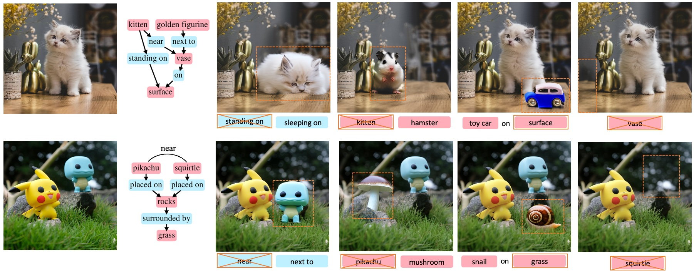

# SGEdit: Bridging LLM with Text2Image Generative Model for Scene Graph-based Image Editing



Zhiyuan Zhang $^{1}$, [Dongdong Chen](https://www.dongdongchen.bid/) $^{2}$, [Jing Liao](https://www.cityu.edu.hk/stfprofile/jingliao.htm) $^{1}$

<font size="1"> $^1$: City University of Hong Kong, Hong Kong SAR
<font size="1"> $^2$: Microsoft GenAI </font>

## Abstract:
Scene graphs offer a structured, hierarchical representation of images, with nodes and edges symbolizing objects and the relationships among them. It can serve as a natural interface for image editing, dramatically improving precision and flexibility. Leveraging this benefit, we introduce a new framework that integrates large language model (LLM) with Text2Image generative model for scene graph-based image editing. This integration enables precise modifications at the object level and creative recomposition of scenes without compromising overall image integrity. Our approach involves two primary stages: Utilizing a LLM-driven scene parser, we construct an image's scene graph, capturing key objects and their interrelationships, as well as parsing fine-grained attributes such as object masks and descriptions. These annotations facilitate concept learning with a fine-tuned diffusion model, representing each object with an optimized token and detailed description prompt. During the image editing phase, a LLM editing controller guides the edits towards specific areas. These edits are then implemented by an attention-modulated diffusion editor, utilizing the fine-tuned model to perform object additions, deletions, replacements, and adjustments. Through extensive experiments, we demonstrate that our framework significantly outperforms existing image editing methods in terms of editing precision and scene aesthetics.

## TODO List
- [x] Basic Usage
- [ ] Gradio demo
- [ ] Evaluation code
- [ ] More examples

## Installation
Step 1 - Install the conda virtual environment:
```bash
conda create -n SGEdit python=3.10
conda activate SGEdit
conda install pytorch torchvision pytorch-cuda=12.1 -c pytorch -c nvidia
pip install -r requirements.txt
```

Step 2 - Download the Grounded-Segment-Anything weights:
```bash
mkdir checkpoints && cd checkpoints
wget https://dl.fbaipublicfiles.com/segment_anything/sam_vit_h_4b8939.pth
wget https://github.com/IDEA-Research/GroundingDINO/releases/download/v0.1.0-alpha/groundingdino_swint_ogc.pth
cd ../
```

Step 3 - Install Grounded-SAM: 
(Recommend: Follow their instruction if this encounter some problem, usually CUDA and Pytorch mismatch)
```bash
git clone https://github.com/IDEA-Research/Grounded-Segment-Anything.git
cd Grounded-Segment-Anything
git reset --hard a52c6b5

export AM_I_DOCKER=False
export BUILD_WITH_CUDA=True
export CUDA_HOME=/path/to/cuda-12/ # modified this to your CUDA version

python -m pip install -e segment_anything
pip install --no-build-isolation -e GroundingDINO
cd ../
```

Step 4 - Get Your OpenAI API key:
```
echo "OPENAI_API_KEY=YourAPIKey" >> .env
```

## Usage
```
python run_full_pipeline.py \
        --image_path inputs/input.png \
        --modification_path inputs/modification.txt \
        --out_dir outputs/
```
1. The concept learning process consumes around 27G of memory. You can further turn on `with_prior_preservation` in `training_config.yaml` as described in the paper. However, it usually consumes more memory (around 33G) and takes some time to generate class images.

2. Currently, we only test square input images. You can crop and resize your image to `512 × 512` before usage.

3. Due to the uncertainty in the outputs of LLM and diffusion models, you may get different scene graphs, editing proposals, and editing results. Before making edits, you need to adjust the `inputs/modifications.txt` file based on the scene graph you receive. A Gradio app will be available soon to make it more convenient for users.